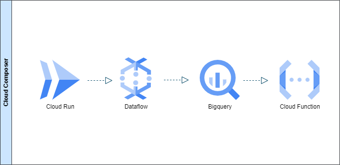
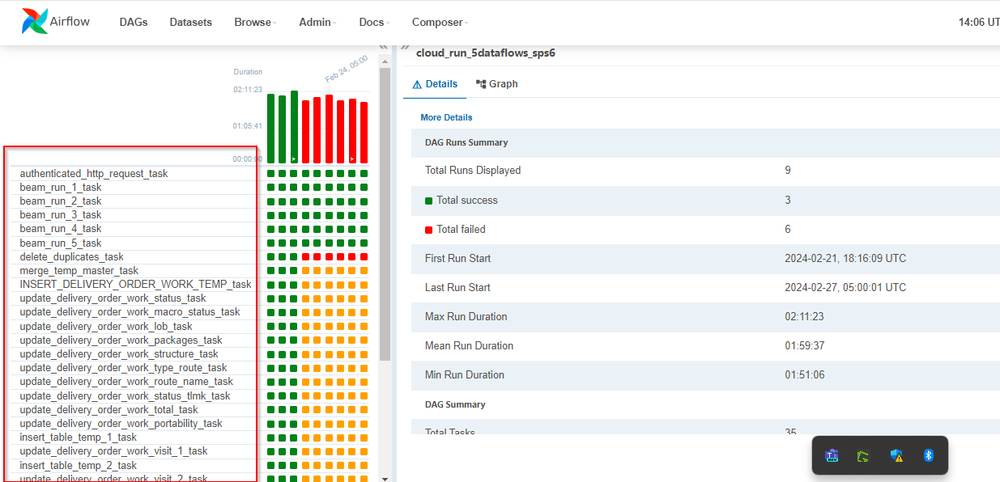

# Case Study Documentation (ETL Approach 1)
## Problem Statement

Every day at 2:00 am, a bash process must be executed. What does this bash do? Through a POST request to an endpoint of a "third-party system," a very large nested JSON object with many objects inside (each internal object is a purchase order made by a customer) is returned. An order has around 100 fields or attributes, so it's quite complex but well-structured (it includes, for example, the buyer's name, the product, the shipping address, etc.).

The POST request returns the orders from the last 5 months. Considering that on any given day there are about 6000 orders, and on a day like Christmas, there can be up to 20000 orders due to high demand, you'll notice that this already represents a Big Data environment. It's important to note here that this POST request does not return the orders of the last 5 months in a single request; in reality, the API only returns 100 orders at a time due to performance issues, so a kind of pagination of 100 by 100 is needed until reaching all the orders from 5 months back. The API has a "total order" field, and it is known up to when to iterate.

Let's continue with the general scenario of the exercise. The POST request is made, and each of the orders must be inserted into BigQuery. That is, a BigQuery table must be designed to have the internal attributes of an order as columns. An order has a field that is an identifier, and since this process is going to be done every day, the idea is that the orders that are new or that do not yet exist in BigQuery should be inserted, but if they already exist, they only need to be updated.

Once an order is inserted or updated (whether one or the other, it must always be one or the other), then it must be notified to the "third-party system" through another POST request "telling" it that I now have that order in BigQuery. The idea of making this successful notification is to ensure that there were no problems during an intermediate Transformation process and that the order indeed arrived at BigQuery and is ready for Analysis and Machine Learning in the future.

It must be considered that each order received (and many orders are obtained from several months in a single load) has around 100 raw fields that are not needed in the form they are initially obtained but must undergo a series of transformations until reaching a dataset that is to be inserted into BigQuery in a cleaner form, **_although once in BigQuery another flow of transformations will also run_**. That is why an intermediate tool (Dataflow) is needed that allows performing all these transformations on all the fields and getting them ready to be inserted into a BigQuery table.

## What could be a cost-effective solution in GCP?

### Solution Proposal Analysis:

#### 1. Data Extraction and Intermediate Storage
**Cloud Scheduler & Cloud Functions:** Use Cloud Scheduler to trigger a Cloud Functions daily at 2:00 am. This function will execute the data extraction script. The Cloud Functions will perform the paginated POST requests to the "third-party system". To handle the volume of data, consider storing the intermediate results in an efficient format such as JSON or Avro.

**Google Cloud Storage (GCS):** Store the extracted data in GCS. Choose a suitable file format (CSV, JSON, Avro, or Parquet) according to your processing and subsequent analysis needs.

#### 2. Transformation and Loading into BigQuery
**Apache Beam with Google Cloud Dataflow:** Use Apache Beam to create a data processing pipeline that will run on Dataflow. This pipeline will perform the following operations:
* Read the data from GCS.
* Transform the data if necessary (for example, normalize fields, calculate aggregations, etc.).
* Check if each order already exists in BigQuery and decide whether to insert or update.
* Load the data into the original BigQuery table.
* Perform the necessary transformations and load the data into a second transformed table in BigQuery.

#### 3. Execution of Stored Procedures in BigQuery
Although the tables already have the major transformation done previously by Dataflow, it is still necessary to run various stored procedures in BigQuery that adjust the content of the initial tables to create the final tables.

#### 4. Success Notification
**Cloud Functions for Notification:** Once the data is loaded into BigQuery, another Cloud Functions will be used to notify the "third-party system" through a POST request for each processed order.

#### 5. Process Orchestration
**Cloud Composer (Apache Airflow):** Use Cloud Composer to orchestrate the entire workflow. This includes:
- Triggering the data extraction Cloud Functions and intermediate insertion into GCS.
- Executing the Dataflow pipeline.
- Running stored procedures in BigQuery.
- Triggering the notification Cloud Functions.

### ---------------------- Reasons for This Architecture ----------------------------------
**Scalability and Flexibility:** This architecture is scalable to handle high data volumes and variations in the number of orders (such as during peak seasons).

**Cost-Efficiency:** Using managed services like Cloud Functions, Dataflow, and BigQuery optimizes costs since you pay only for the resources you use.

**Reliability and Maintainability:** By using GCP services, you benefit from high availability and ease of maintenance.

**Automation and Orchestration:** Cloud Composer facilitates dependency management and task sequencing, ensuring that the workflow runs smoothly.

#### Cloud Run VS Cloud Functions VS App Engine
To understand why Cloud Run might be a better option than Cloud Functions or App Engine in this case, it's important to consider the specific characteristics of the task and the capabilities of each platform. Let's compare them in terms of flexibility, execution time, scalability, and costs.

#### Cloud Run 
**Advantages:**
* **Flexibility in Execution Times:** Cloud Run allows for longer execution times compared to Cloud Functions. It can handle tasks that last up to 15 minutes or more, depending on the configuration, which is ideal for this use case.
* **Containerization:** Cloud Run uses containers, giving you the flexibility to include any necessary library or dependency without worrying about the execution environment.
* **Automatic Scaling:** Scales automatically and can scale to zero when not in use, which means you don't pay for downtime.
* **Costs:** You only pay for the execution time of requests, which can be more economical for tasks that run once a day.

**Disadvantages:**
* Requires basic knowledge of containers and Docker.

***

#### Cloud Functions
**Advantages:**
* **Ease of Use:** It's very simple to set up and use, ideal for small and lightweight tasks.
* **Costs:** You only pay for the execution time, which is ideal for functions that run in response to events.

**Disadvantages:**
* **Time Limit:** It has a maximum execution time limit (9 minutes), which is not suitable for this task that may last 15 minutes.
* **Less Flexibility:** Less flexibility in terms of execution environment compared to containers.

***

#### App Engine
**Advantages:**
* **Easy Web Application Deployment:** Great for web applications that require automatic scalability.
* **Infrastructure Management:** Manages the infrastructure for you, reducing maintenance overhead.

**Disadvantages:**
* **Cost and Resources:** Although it scales automatically, it can be more expensive to keep an instance running constantly, especially if the task only needs to run once a day.
* **Execution Time:** Prolonged execution times might not be ideal for App Engine, which is designed more to respond to quick web requests.

***

#### In terms of costs:

* **Cloud Run:** You only pay for the actual execution time. If your service is idle, it doesn't incur costs. This makes it ideal for tasks that run at specific times and not constantly.
* **Cloud Functions:** Similar to Cloud Run in terms of costs, but with the mentioned time limitations.
* **App Engine:** May incur higher costs, especially if it needs to be running continuously or handle unpredictable workloads.

#### Partial Conclusion:
For a task that runs daily and may last up to 15 minutes, Cloud Run is probably the best option due to its flexibility, ability to handle longer execution times, and a pricing model that only charges you for the actual execution time. Additionally, it gives you the flexibility of working with containers, meaning you can set up your environment exactly as you need it.

## Solution Proposal

1. A Cloud Run contains a Python app that is responsible for making paginated requests to the "third-party system" and placing each extracted JSON object in GCS, (in a .json file corresponding to the requested day) which has all the JSON objects extracted from the requests. (A file is generated per day). (_**See App extract-ceo-app-repository**_)

1. CI/CD techniques are used for this deployment. In the Code Editor of Cloud Shell. Once the code has been tested locally using a Python virtual environment to isolate dependencies. A push is made to a branch, for example, Staging (repository previously created in Cloud Sources Repositories).

1. Making this Push triggers a Cloud Build (GCP's CI/CD tool) that reads the Dockerfile and proceeds to build an image. This image is automatically stored in Container Registry.

1. From Cloud Run, this image is imported and deployed. (This last part can be manual or automatic by reading some update from a branch of the repository). It is worth noting that this URL provided by Cloud Run can be public or protected (requiring authentication, the variant chosen in this case).

1. 5 Dataflows are performed. The goal of each is to disaggregate nested and complex JSON fields within each extracted object and convert it into a different BigQuery table (using FlatMap transformations that allow a single element to be transformed into several output elements, this is because a JSON subfield is an array of several JSON objects in turn).

1. First, the Beam pipeline is developed in Jupyter Notebook (Dataflow Workbench), this is to take advantage of data exploration capabilities, visualization, and intermediate tests that are useful during the development of the pipeline, DirectRunner is also used to execute this pipeline and see a progressive result.

1. Once a baseline of the pipeline is available, it is then transferred (exported to .py) to a more suitable development environment to continue with respective testing, development, and deployment. Once in the Code Editor of the GCP Shell, the development is tested in a Python virtual environment to ensure functionality with the appropriate dependencies.

1. Then, the design of Unit Tests using Python's UnitTest Framework is proceeded. It consists of developing multiple unit tests that must subsequently be executed when the project (pipeline) is deployed.

1. Then, a CI/CD flow is designed through the cloudbuild.yaml file and GCP's Cloud Build tool. The goal is that when a push is made to a branch, for example, Staging in Cloud Source Repositories, the cloudbuild.yaml file is executed (this is done by configuring a Cloud Build trigger that reads the .yaml). This .yaml defines a series of steps in order during deployment to the repository prioritizing the automatic execution of unit tests, and if they pass correctly, it continues with a second step which would be copying this beam pipeline (file .py) to the corresponding GCS bucket of the Airflow DAG (Composer) since the scheduled task of Composer will always be reading from this file in this location to execute the daily task. (_**See App alas_dataflow_1_repository**_).

1. At this point, the entire scheme of tables and stored procedures within BigQuery needs to be developed, (the schemes of the 5 tables to test the 5 dataflows should exist). A series of stored procedures are proceeded with, which are transformations from the 5 initial tables coming from the 5 dataflows. Transformations that require the use of Update and Delete continuously until reaching the tables delivery_order_master (historical) and delivery_order_work (Final).

1. Orchestration through Composer, a DAG is created (_**See Composer/DAG_cloudrun_dataflow_sp**_) and uploaded to the corresponding DAG bucket generated by Composer during the initial configuration. This DAG basically starts a series of tasks at 2:00 am beginning with the call (authenticated) to the Cloud Run (using PythonOperator). It triggers the reading of orders and stores in GCS the JSON files of each day of the last 5 months. Then triggers 5 dataflows (which generate temporary tables in BigQuery) (using BeamRunPythonPipelineOperator) in order and finally all the stored procedures (BigQueryExecuteQueryOperator) in the correct order. Below is shown the construction/execution process of Cloud Composer (Managed version of Apache Airflow).

## Conclusion
Beneath Cloud Composer lies a Kubernetes cluster. Cloud Composer uses Google Kubernetes Engine (GKE) to orchestrate and manage the containers that run Apache Airflow and its related components. This approach leverages the scalability, infrastructure management, and self-healing capabilities of Kubernetes, providing a robust and scalable platform for workflow orchestration.

Therefore, however, the use of Cloud Composer ends up being costly, and the paradigm of **_(request to cloud run and save in GCS + creation of 5 sequential dataflows that read from GCS and transform + execution of 30 stored procedures in BigQuery)_** causes slowness in the workflow. Moreover, Composer has to first start the infrastructure of each Dataflow before launching a job on it. The process takes about 2 hours, which does not meet the efficiency/performance criteria.

For this particular Case Study, the ETL approach used with Cloud Composer orchestrating all the processes is not cost/effective, so a new architectural alternative of the ELT type is proceeded to be analyzed. **[(See Case Study 2 ELT Approach)](https://github.com/rocamil85/Case-Study-2-ELT-Approach)**.

